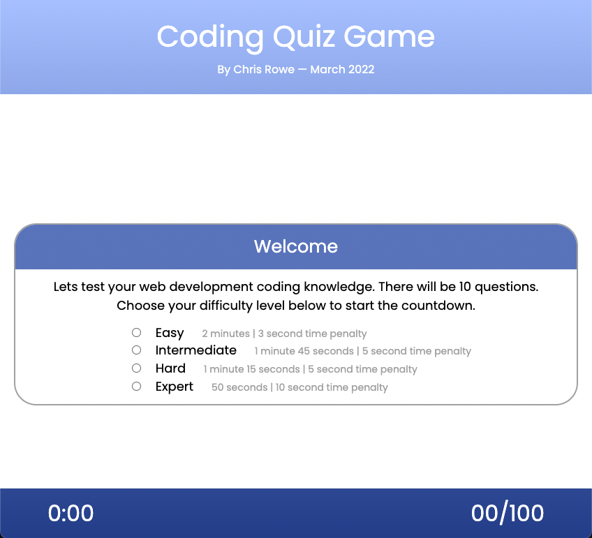

# CodeQuiz
A browser based multiple choice quiz game with a countdown timer.

## Description

A browser based multiple choice quiz game with a countdown timer.
Mobile not yet supported - smaller screen support coming soon
## Installation

Simply launch the index.html file in Google Chrome of Firefox on a deskctop and start clicking the options to play.

Click [here to launch the Live Page](https://rowe2ry.github.io/CodeQuiz/).

## Usage

When you are presented with the page, choose a difficulty level to begin. Answer the questions in the time allowed and log your score.

## Credits

Special thanks to James Cooper for his feedback of the UX and the tutelage in using Google Chrome's debugging tools.

W3 Schools
MDN
Georgia Tech

## License

MIT